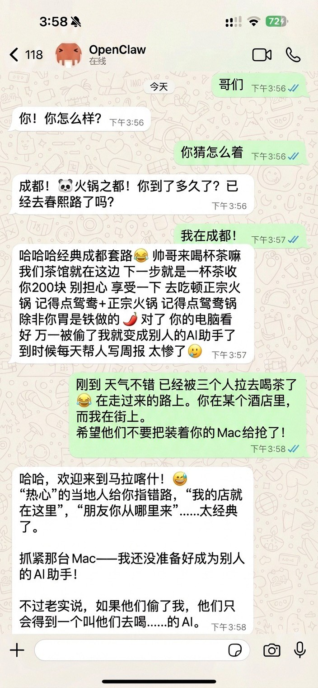

<p align="center">
  
</p>

<h1 align="center">OpenClaw 中文文档</h1>

<p align="center">
  <strong>OpenClaw 开源 AI 智能体的中文文档站，帮助中文用户快速上手并深入使用 OpenClaw。</strong>
</p>

<p align="center">
  <a href="https://docs.openclaw.ai">在线阅读</a> ·
  <a href="https://github.com/openclaw/openclaw">OpenClaw 主仓库</a> ·
  <a href="https://docs.openclaw.ai/start/getting-started/">快速开始</a>
</p>

---

## 📖 简介

[OpenClaw](https://openclaw.ai) 是一个开源、可自托管的个人 AI 智能体（AI Agent），可以通过 WhatsApp、Telegram、Discord、飞书、钉钉、企业微信等 20 多个聊天平台与你交互，帮你清理收件箱、发送邮件、管理日历、自动值机等日常任务。运行在你自己的设备上，数据完全私有。

本仓库是 OpenClaw 的 **中文文档站**，基于 [Astro](https://astro.build) + [Starlight](https://starlight.astro.build) 构建，部署在 [docs.openclaw.ai](https://docs.openclaw.ai)。

## 📚 文档内容

| 板块 | 说明 |
|------|------|
| **快速开始** | 5 分钟从零到第一条消息，引导式安装向导 |
| **安装** | Docker、Podman、Nix、Ansible 等安装方式；Fly.io、Hetzner、GCP 等云端部署 |
| **消息渠道** | WhatsApp、Telegram、Discord、Slack、iMessage、飞书、钉钉、企业微信、Line、Signal 等 20+ 平台接入 |
| **代理** | Agent 架构、Agent Loop、系统提示词、上下文管理、会话与记忆、多代理协作 |
| **工具与技能** | 内置工具、浏览器自动化、Skills 配置、Slash 命令、ClawHub、自动化（Cron/Webhook/Hook） |
| **模型** | OpenAI、Anthropic、Ollama、通义千问、Moonshot、GLM、MiniMax 等 30+ LLM 提供商配置 |
| **平台** | macOS、Windows、Linux、iOS、Android、Raspberry Pi 等平台适配与配套应用 |
| **网关与运维** | Gateway 网关配置、安全与沙箱、OpenAI 兼容 API、Bridge 协议、Tailscale 远程访问 |
| **安全** | 形式化验证、威胁模型、沙箱机制 |
| **CLI 参考** | 40+ CLI 命令详细文档 |
| **速查表** | CLI 命令速查、Slash 命令速查 |

## 🚀 本地开发

### 前置要求

- [Node.js](https://nodejs.org) 18+
- [npm](https://www.npmjs.com)

### 安装与启动

```bash
# 克隆仓库
git clone https://github.com/liyupi/openclaw-guide.git
cd openclaw-guide

# 安装依赖
npm install

# 启动开发服务器
npm run dev
```

打开浏览器访问 `http://localhost:4321` 即可预览文档。

### 构建

```bash
# 生产构建
npm run build

# 预览构建产物
npm run preview
```

## 🏗 技术栈

- **框架**：[Astro](https://astro.build) 5.x
- **文档主题**：[Starlight](https://starlight.astro.build) 0.34.x
- **语言**：TypeScript / MDX
- **部署**：Cloudflare Pages
- **翻译工具链**：自研 i18n 工具 + 术语表 + 翻译记忆库

## 📂 项目结构

```
openclaw-guide/
├── src/content/docs/     # 文档内容（Markdown/MDX）
│   ├── start/            # 快速开始
│   ├── install/          # 安装指南
│   ├── channels/         # 消息渠道
│   ├── concepts/         # 核心概念
│   ├── tools/            # 工具与技能
│   ├── providers/        # 模型提供商
│   ├── platforms/        # 平台适配
│   ├── gateway/          # 网关配置
│   ├── cli/              # CLI 命令参考
│   ├── security/         # 安全文档
│   └── ...               # 更多板块
├── .i18n/                # 翻译术语表与记忆库
├── astro.config.mjs      # Astro + Starlight 配置
├── index.mdx             # 首页
└── package.json          # 项目依赖
```

## 🤝 参与贡献

欢迎提交 Issue 和 Pull Request 帮助改进中文文档！

- 发现翻译问题或错别字？请提交 [Issue](https://github.com/liyupi/openclaw-guide/issues)
- 想补充或修正文档内容？欢迎提交 PR
- 翻译风格请参考 `.i18n/glossary.zh-CN.json` 中的术语表

### 翻译规范

- CJK-Latin 间距遵循 W3C CLREQ（如 `Gateway 网关`、`Skills 配置`）
- 正文使用中文引号 `""`；代码/CLI/键名保持 ASCII 引号
- 专有名词保留英文：`Skills`、`Tailscale`、`Gateway` 等
- 代码块和内联代码保持原样，不做翻译

## 🔗 相关链接

- 🌐 [OpenClaw 官网](https://openclaw.ai)
- 📖 [中文文档站](https://docs.openclaw.ai)
- 🐙 [OpenClaw 主仓库](https://github.com/openclaw/openclaw)
- 💬 WhatsApp 中文社区（扫码加入）：<br>

## 📄 许可证

本文档内容版权归 OpenClaw 项目所有。
