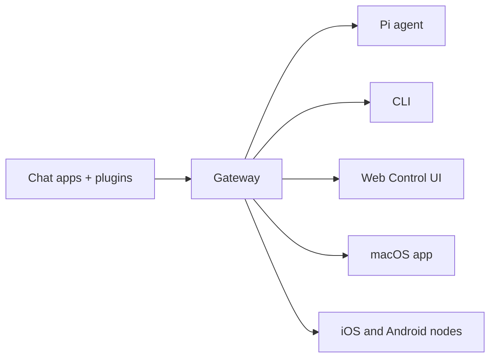

import { Card, CardGrid, LinkCard } from '@astrojs/starlight/components';

<p align="center">
    
    
</p>

<style>{`
  :root[data-theme='dark'] .sl-logo-light { display: none; }
  :root[data-theme='dark'] .sl-logo-dark  { display: block; }
  :root[data-theme='light'] .sl-logo-light { display: block; }
  :root[data-theme='light'] .sl-logo-dark  { display: none; }
`}</style>

> _"去壳！去壳！"_ — 大概是一只太空龙虾说的

<p align="center">
  <strong>适用于任何操作系统的 AI 智能体 Gateway 网关，支持 WhatsApp、Telegram、Discord、iMessage 等。</strong><br />
  发送消息，随时随地获取智能体响应。通过插件可添加 Mattermost 等更多渠道。
</p>

<CardGrid>
  <LinkCard title="入门指南" href="/start/getting-started" description="安装 OpenClaw 并在几分钟内启动 Gateway 网关。" />
  <LinkCard title="运行向导" href="/start/wizard" description="通过 `openclaw onboard` 和配对流程进行引导式设置。" />
  <LinkCard title="打开控制界面" href="/web/control-ui" description="启动浏览器仪表板，管理聊天、配置和会话。" />
</CardGrid>

OpenClaw 通过单个 Gateway 网关进程将聊天应用连接到 Pi 等编程智能体。它为 OpenClaw 助手提供支持，并支持本地或远程部署。

## 工作原理



Gateway 网关是会话、路由和渠道连接的唯一事实来源。

## 核心功能

<CardGrid>
  <Card title="多渠道 Gateway 网关">
    通过单个 Gateway 网关进程连接 WhatsApp、Telegram、Discord 和 iMessage。
  </Card>
  <Card title="插件渠道">
    通过扩展包添加 Mattermost 等更多渠道。
  </Card>
  <Card title="多智能体路由">
    按智能体、工作区或发送者隔离会话。
  </Card>
  <Card title="媒体支持">
    发送和接收图片、音频和文档。
  </Card>
  <Card title="Web 控制界面">
    浏览器仪表板，用于聊天、配置、会话和节点管理。
  </Card>
  <Card title="移动节点">
    配对 iOS 和 Android 节点，支持 Canvas。
  </Card>
</CardGrid>

## 快速开始

1. 安装 OpenClaw

   ```bash
   npm install -g openclaw@latest
   ```

2. 新手引导并安装服务

   ```bash
   openclaw onboard --install-daemon
   ```

3. 配对 WhatsApp 并启动 Gateway 网关

   ```bash
   openclaw channels login
   openclaw gateway --port 18789
   ```

需要完整的安装和开发环境设置？请参阅[快速开始](/start/quickstart)。

## 仪表板

Gateway 网关启动后，打开浏览器控制界面。

- 本地默认地址：http://127.0.0.1:18789/
- 远程访问：[Web 界面](/web)和 [Tailscale](/gateway/tailscale)

<p align="center">
  
</p>

## 配置（可选）

配置文件位于 `~/.openclaw/openclaw.json`。

- 如果你**不做任何修改**，OpenClaw 将使用内置的 Pi 二进制文件以 RPC 模式运行，并按发送者创建独立会话。
- 如果你想要限制访问，可以从 `channels.whatsapp.allowFrom` 和（针对群组的）提及规则开始配置。

示例：

```json5
{
  channels: {
    whatsapp: {
      allowFrom: ["+15555550123"],
      groups: { "*": { requireMention: true } },
    },
  },
  messages: { groupChat: { mentionPatterns: ["@openclaw"] } },
}
```

## 从这里开始

<CardGrid>
  <LinkCard title="文档中心" href="/start/hubs" description="所有文档和指南，按用例分类。" />
  <LinkCard title="配置" href="/gateway/configuration" description="核心 Gateway 网关设置、令牌和提供商配置。" />
  <LinkCard title="远程访问" href="/gateway/remote" description="SSH 和 tailnet 访问模式。" />
  <LinkCard title="渠道" href="/channels/telegram" description="WhatsApp、Telegram、Discord 等渠道的具体设置。" />
  <LinkCard title="节点" href="/nodes" description="iOS 和 Android 节点的配对与 Canvas 功能。" />
  <LinkCard title="帮助" href="/help" description="常见修复方法和故障排除入口。" />
</CardGrid>

## 了解更多

<CardGrid>
  <LinkCard title="完整功能列表" href="/concepts/features" description="全部渠道、路由和媒体功能。" />
  <LinkCard title="多智能体路由" href="/concepts/multi-agent" description="工作区隔离和按智能体的会话管理。" />
  <LinkCard title="安全" href="/gateway/security" description="令牌、白名单和安全控制。" />
  <LinkCard title="故障排除" href="/gateway/troubleshooting" description="Gateway 网关诊断和常见错误。" />
  <LinkCard title="关于与致谢" href="/reference/credits" description="项目起源、贡献者和许可证。" />
</CardGrid>
